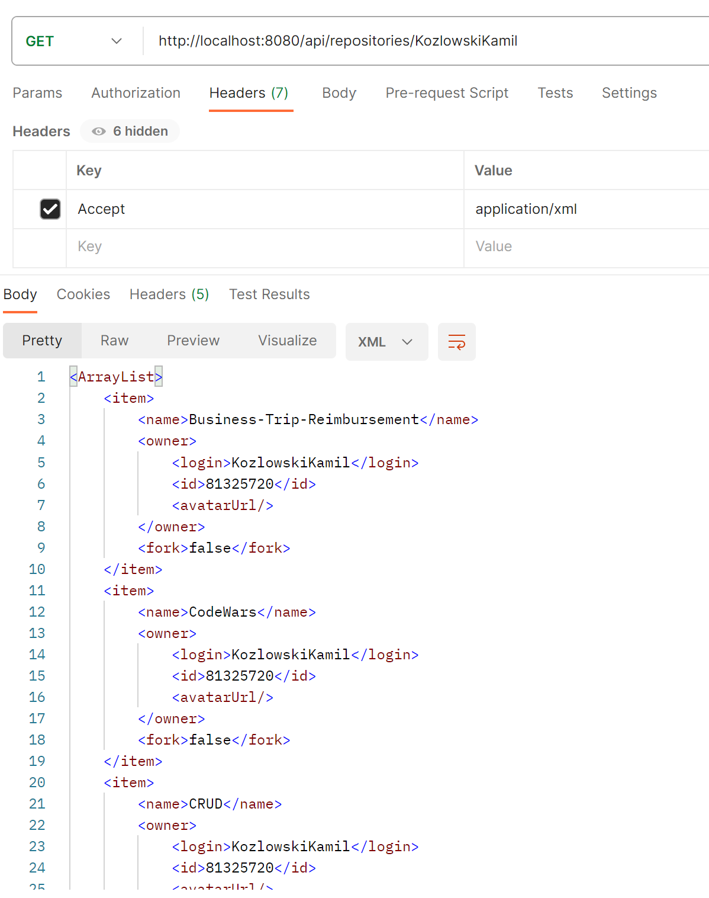
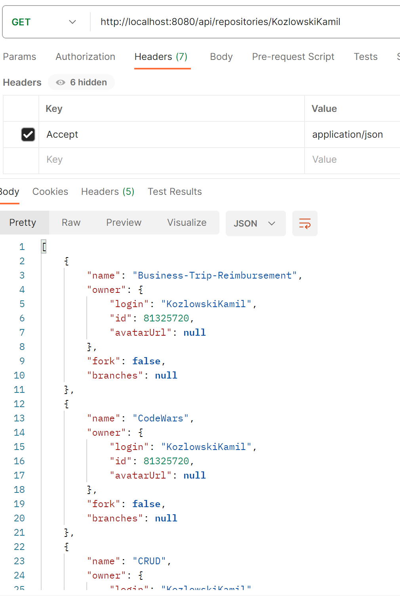

# GitHub Repository Viewer with Java and Spring

## Overview

This is a web application built with Java and Spring frimework that allows you to view a list of GitHub repositories for a given user. 
It provides information about each repository, including the name, owner, and the latest commit on the default branch. 
The frontend is developed using HTML, CSS, and Bootstrap.

## Features

- List GitHub repositories by username.
- Display repository details like name and owner.
- Show the latest commit on the default branch.

## Technologies Used

- Java
- Spring Boot
- HTML
- CSS
- Bootstrap
- GitHub API

## Author

This project was created by [KozlowskiKamil](https://github.com/KozlowskiKamil).

## Setup and Testing with Postman

To run this application locally, follow these steps:

To run and test this application locally, follow these steps:

Clone this repository.
Open the project in your Java IDE.
Run the Spring Boot application.
Now, to interact with the API and retrieve GitHub repository data, you can use Postman:

1. Open Postman and create a new request.

2. Set the request type to GET.

3. Enter the following URL in the request URL field:
`http://localhost:8080/api/repositories/{username}`
   -Replace {username} with the GitHub username you want to retrieve repositories for.
4. Add a Header to specify the desired response format:

    Key: Accept
Value: application/json for JSON format or application/xml for XML format.

5. Click the "Send" button to make the request.

    Postman will send the request to your local Spring Boot application, which will in turn fetch data from the GitHub API and return the response based on the format you specified. You will receive a list of GitHub repositories for the provided username.

    This allows you to test the application's functionality and verify that it retrieves GitHub repository data as expected.

## Screenshots

Here are screenshots of the Postman requests:

## Contributing

Contributions are welcome! If you have any ideas or suggestions for improvement, please open an issue or create a pull request.

## License

This project is licensed under the MIT License - see the [LICENSE](LICENSE) file for details.
